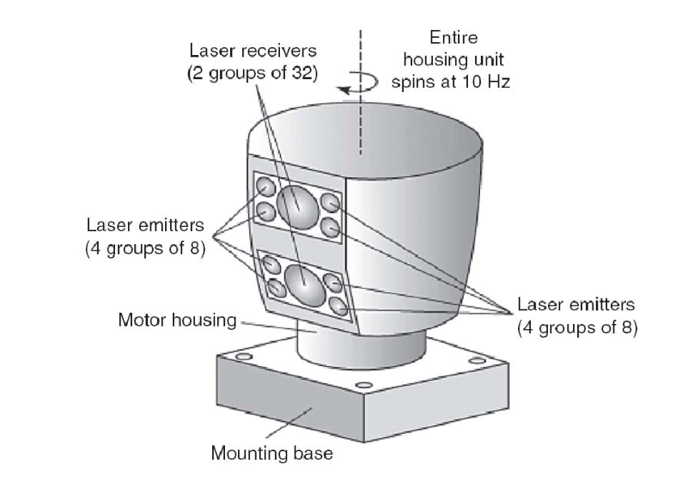

# Coursera, GPU Specialization Capstone Project
## Onur Can Yucedag

# Parallel LiDAR Point Cloud Preprocessing for Autonomous Driving Applications

## Problem Description

In autonomous driving scenarios, LiDAR is a cruicial sensor that is being used to solve various tasks. Localization and 3D Perception are examples where modern LiDAR shines. 

LiDAR sensor provides a rich Point Cloud of the environment. For 3D Perception task, there are couple of steps to extract and distill the information of Point Cloud so that the output preprocessed data could be used further clustering or detection modules. We call this `LiDAR Preprocessing`. 

Lot's of clustering and detection modules are requires to have an underlying Point Cloud Preprocessing pipelines that can remove unwanted points and do some basic segmentation.

Formation of the Point Cloud itself depends on the mechanical and electrical properties of the LiDAR sensor. The most common LiDAR sensors are so called `spinning lidars`

### Spinning LiDARs Inner Workings

Spinning LiDARs are rotating sensors that emit laser beams and measure the time it takes for the laser to return to the sensor. The sensor then calculates the distance to the object based on the time it took for the laser to return. The sensor rotates 360 degrees and measures the distance to objects in all directions. The result is a 3D point cloud that represents the environment around the sensor.

The Point Cloud formation itself creates a motion distortion. Since the start and end of the rotation are not measured at the same time, the point cloud is distorted. This distortion is called `motion distortion` and it is a common problem in spinning LiDARs.

In order to achieve a better 3D Perception, the motion distortion should be removed from the point cloud. This is a crucial step in the LiDAR Preprocessing pipeline

## Work Description

Motion distortion problem can be introduced by two factors:
- The motion distortion that is created just by the spinning of the LiDAR sensor and ego-motion of the vehicle
  - Since Autonomous Vehicles are moving, the point cloud is also moving. This creates a motion distortion in the point cloud
- The motion distortion that is created by the dynamic objects in the environment
  - Since the objects are also moving, the point cloud is also moving. This creates a motion distortion in the point cloud

In this project, we will focus on the first type of motion distortion. We will try to remove the motion distortion from the point cloud that is created by the spinning of the LiDAR sensor and ego-motion of the vehicle.

The main goal of the project is to remove the motion distortion from the point cloud. The project will be implemented in C++ and CUDA and there will be support for ROS based systems.

Following libraries will be used in the project:
- PCL (Point Cloud Library)
- Thrust (CUDA C++ Library)
- CUDA (NVIDIA's parallel computing platform and programming model)
- OpenMP (Open Multi-Processing)
- ROS (Robot Operating System)
- Eigen (C++ template library for linear algebra)

The final output should look like the following:

# Development Process
## High Level Design

## Execution Time Analysis

# References
- Innoviz Technologies: https://innoviz.tech/
- Toth, Charles K. "R&D of mobile LIDAR mapping and future trends." Proc. ASPRS Annu. Conf. 2009.
- LIVOX Showcase: https://www.livoxtech.com/showcase/211220